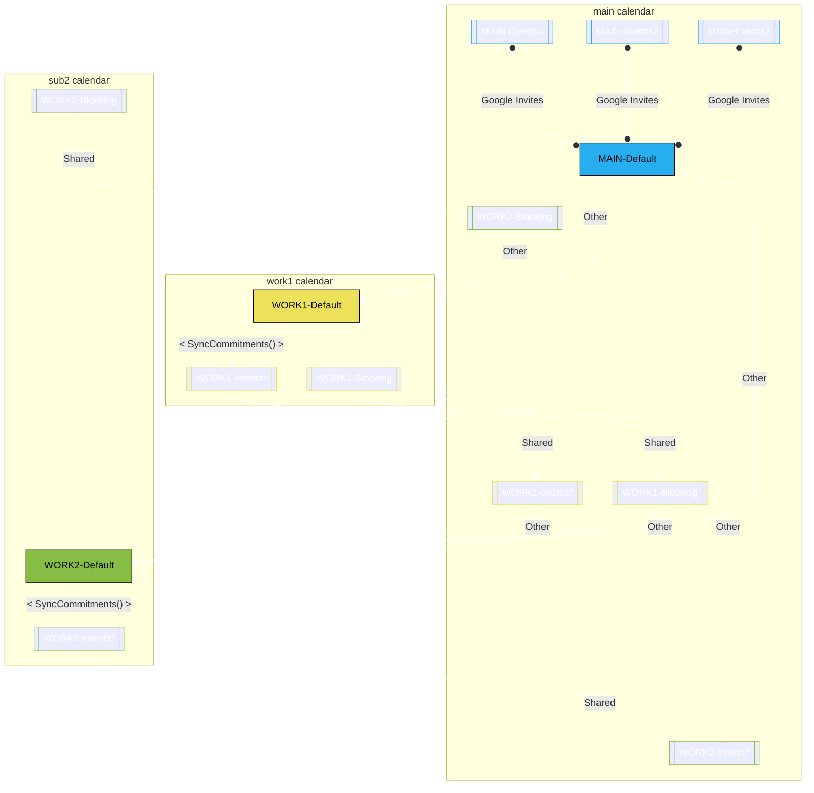

# calendar-sync

## General Diagram
Below is a brief layout of how I synchronize my personal and work calendars

## Main Functions
- `SyncCommitments`: used to synchronize between a `WORK` calendar with its associated `WORK_1_Star` calendar (a copy of the main work calendar, with transformations of the event title, color, description, etc based on the status of that event)
- `SyncForSharing`: used to copy events from **multiple** calendars into a destination calendar that can be used for sharing. Highly customizable based on what things to be shown, etc.